## 

</br>
</br>
<font size=7>
**1、研究背景 ** 
</font>

</br>
</br>
<font size=7>
**2、文献综述**    
</font>

</br>
</br>
<font size=7>
**3、描述性统计**   
</font>

</br>
</br>
<font size=7>
**4、相关分析**     
</font>

</br>
</br>
<font size=7>
**5、GAM模型**       
</font>

<br/>
<br/>
<br/>
<br/>

# 1 研究背景

## 研究背景

<font size=5.5>
&emsp;&emsp;2019年12月，湖北省武汉市爆发新型冠状病毒肺炎（COVID-19），此后该疾病伴随春运客流在短时间内迅速蔓延到其他省份乃至周边国家，各地疑似和确诊病例数急速增加。在2020年第一季，新型冠状病毒肺炎在在世界范围内广泛传播，对公共卫生和世界经济产生了重大影响，引起了国内外的高度重视。
</font>

<font size=5.5>
&emsp;&emsp;传染病的发生、传播、流行与气象条件和空气污染密切相关。特定的气象条件对呼吸道疾病有一定的诱发作用，病毒的活跃程度和扩散能力与气温、气压、湿度、风速、降水、日照等气象因素密切相关。空气污染会削弱人体的呼吸道，并抑制其预防感染的能力，增加对病毒的易感性。
</font>

<font size=5.5>
&emsp;&emsp;目前，新型冠状病毒的主要传播途径是呼吸道飞沫和接触传播。湿度、风速等会影响到环境中液滴的稳定性；温度则可能会影响病毒在传播路径上的活性；污染微粒为病毒提供了寄身场所，帮助病毒扩散，进而影响新冠病毒的传播。
</font>

<font size=5.5>
&emsp;&emsp;本研究基于武汉市的气象数据、空气污染数据与新型冠状病毒肺炎的发病情况，探索气象因素、大气污染物与COVID-19之间的关系。
</font>

<br/>
<br/>
<br/>
<br/>

# 2 文献综述


## 文献综述

<font size=5.5>
**文献1：**An effect assessment of Airborne particulate matter pollution on COVID-19: A multi-city Study in China   
</font>

<font size=5.5>
**作者：**Bo Wang, Jiangtao Liu, Shihua Fu, Xiaocheng Xu, Lanyu Li, Yueling Ma, Ji Zhou, Jinxi Yao, Xingrong Liu, Xiuxia Zhang, Xiaotao He, Jun Yan, Yanjun Shi, Xiaowei Ren, Jingping Niu, Bin Luo, Kai zhang    
</font>

<font size=5.5>
**目的：**研究空气颗粒物（PM）污染对中国各地COVID-19的影响。
</font>

<font size=5.5>
**方法：**利用2020年1月20日至3月2日确诊病例均超过50例的72个城市的数据，建立广义相加模型，通过控制平均温度、绝对湿度和迁移规模指数来估计空气颗粒物污染（PM2.5和PM10）与各城市每日确诊病例之间的关系。      
</font>

<font size=5.5>
**结论：**PM2.5、PM10与COVID-19之间存在正相关关系，并且在滞后14天时对COVID-19的影响最大。说明空气中的PM污染可能会增加感染COVID-19的风险。
</font>

## 文献综述

<font size=5.5>
**文献2：**COVID-19 transmission in Mainland China is associated with temperature and humidity: a time-series analysis
</font>

<font size=5.5>
**作者：**Hongchao, Shuang Xiao, Runye Shi, Michael P . Ward, Yue Chen, Wei Tu, Qing Su, Wenge Wang, Xinyi Wang, Zhijie Zhang
</font>

<font size=5.5>
**目的：**研究中国30个省份（除西藏外）的气象因素与COVID-19每日病例数之间的相关性。
</font>

<font size=5.5>
**方法：**利用2019年12月1日至2020年2月11日的湖北数据，1月20日至2月11日其余省份的数据，通过14天指数移动平均线考虑潜在的滞后效应，建立广义相加模型分析平均气温和相对湿度对每日确诊病例的影响。
</font>

<font size=5.5>
**结论：**各省气象因子对COVID-19影响不一致。其中，湖北省的平均气温和相对湿度与COVID-19呈显著负相关；并且平均气温和相对湿度之间存在显著的交互作用。
</font>

## 文献综述

<font size=5.5>
**文献3：**Effects of temperature variation and humidity on the mortality of COVID-19 in Wuhan
</font>

<font size=5.5>
**作者：**Yueling Ma, Yadong Zhao, Jiangtao Liu, Xiaotao He, Bo Wang, Shihua Fu, Jun Yan, Jingping Niu, Bin Luo
</font>

<font size=5.5>
**目的：**探讨武汉市新型冠状病毒肺炎死亡人数与气象因素之间的关系。
</font>

<font size=5.5>
**方法：**收集了2020年1月20日至2020年2月29日中国武汉每天的COVID-19死亡人数、气象和空气污染物数据。然后，使用广义相加模型分析温度、湿度和昼夜温度范围对COVID-19日病死率的影响。
</font>

<font size=5.5>
**结论：**      
- 日温度范围与COVID-19死亡率呈正相关，而温度、绝对湿度与COVID-19死亡率呈现负相关。    
- 在控制了空气污染等因素的影响后，在滞后3天时，日温度范围每增加1个单位， COVID-19死亡率增加2.92%；在滞后3天和5天时，随着温度和绝对湿度的增加，COVID-19的死亡率降低。
</font>

## 文献综述

<font size=5.5>
**文献4：**Meteorological factors correlate with transmission of 2019-nCoV: Proof of incidence of novel coronavirus pneumonia in Hubei Province, China
</font>

<font size=5.5>
**作者：**Jianfeng Li, Linyuan Zhang, Zhihua Ren, Caihong Xing, Peihuan Qiao, Bing Chang
</font>

<font size=5.5>
**目的：**探讨湖北省各种气象因素对COVID-19发病率的影响。
</font>

<font size=5.5>
**方法：**收集1月18日截至3月10日的湖北省每日确诊病例和10个气象参数的数据（平均气压、平均气温、最高气温、最低气温、平均水汽压、平均相对湿度、平均风速、降水量、总太阳辐射、最大太阳辐照度）。通过相关分析和线性回归，判断气象因素与COVID-19新增确诊病例之间的关系。
</font>

<font size=5.5>
**结论：**    
- 湖北省新增确诊病例与平均气压、平均气温、最低气温和平均水汽压这4个气象参数相关。其中，平均压力与增量呈正相关，平均温度、最低温度和平均水汽压则呈现负相关。    
- 线性回归结果显示，如果最低温度增加1个单位,湖北新增确诊病例将平均减少72.470个单位。
</font>

## 文献综述

<font size=5.5>
**文献5：**Meteorological factors and domestic new cases of coronavirus disease (COVID-19) in nine Asian cities: A time-series analysis
</font>

<font size=5.5>
**作者：**Zonglin He, Yiqiao Chin, Jian Huang, Yi He, Babatunde O. Akinwunmi, Shinning Yu, Casper JP Zhang, Wai-kit Ming
</font>

<font size=5.5>
**目的：**调查亚洲9个城市的气象因素与COVID-19每日新增病例的相关性。（北京、武汉、上海、广州、香港、首尔、东京、吉隆坡和新加坡）
</font>

<font size=5.5>
**方法：**采用Pearson相关分析和广义相加模型，评估每日新增COVID-19病例与气象因子（平均气温和相对湿度）之间的关系。
</font>

<font size=5.5>
**结论：**不同城市和滞后期的气象因素与COVID-19每日确诊病例数之间的相关性不一致。这表明气象因素不太可能对COVID-19疫情产生重大影响。
</font>

## 数据来源

<font size=5.5>
**疫情数据：**来源于[湖北省卫生健康委员会](http://wjw.hubei.gov.cn/)，选取武汉市2020年1月20日至

2020年3月31日的每日确诊病例数和每日死亡病例数。   
</font>

</br>
<font size=5.5>
 **气象数据： **来源于[中国气象数据网](https://data.cma.cn/)，选取武汉市2020年1月1日至2020年
</font>

<font size=5.5>
3月31日的每日平均气温、平均相对湿度、日照时数、日温度范围和平均   

风速数据。
</font>

</br>
<font size=5.5>
**空气污染数据：**来源于[中国空气质量在线监测分析平台](https://www.aqistudy.cn/historydata/)，选取武汉市2020     
</font>

<font size=5.5>
年1月1日至2020年3月31日的PM2.5、PM10、SO2、CO、NO2和O3数    

据。
</font>

# 3 描述性统计

## 变量描述
### 变量解释
<div align=center>
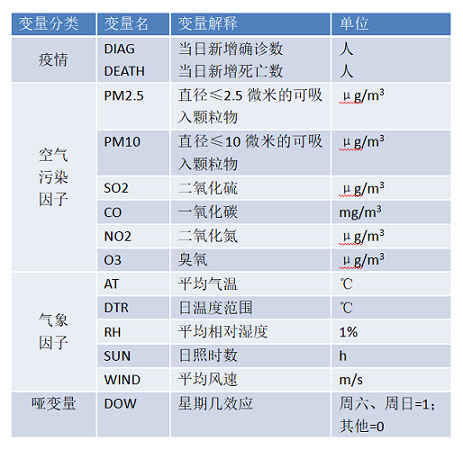
</div>
---

### 变量描述统计
<div align=center>
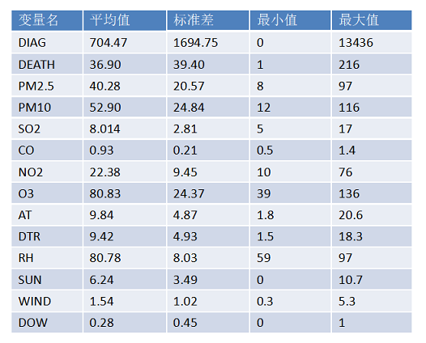
</div>

## 疫情数据描述
### 确诊人数与死亡人数
</br>
<div align=center>
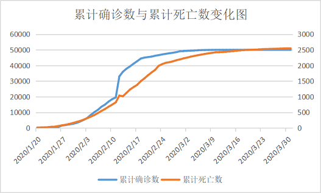
</div>
---

### 确诊人数与死亡人数
</br>
<div align=center>

</div>
</br>
</br>
</br>
&emsp;&emsp;武汉市累计确诊数与累计死亡数曲线、新增确诊数与新增死亡数曲线均基本一致。

---

### 武汉各区疫情情况
</br>
</br>
（1）武汉市各区域累计确诊人数变化折线图 - ggplot包
</br>
</br>
```r
ggplot(data = data, mapping = aes(x = day, y = num, colour = area,group = area )) +
  geom_line(size = 0.5) +
  geom_point(size = 1) +
  labs(title = "武汉市各区域累计确诊人数变化折线图:",x = '时间',y = '人数/人') + 
  theme(axis.text.x = element_text(angle = 60, hjust = 0.5, vjust =0.5 ,size = 8))
```
---

### 武汉各区疫情情况
</br>
<div align=center>
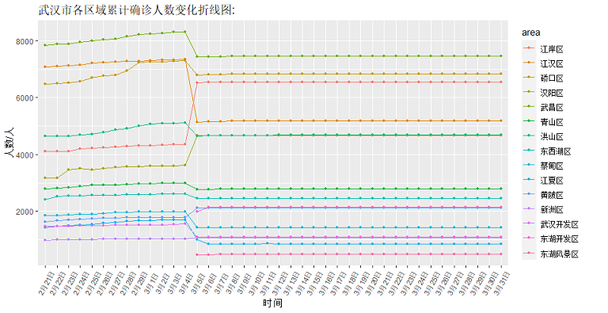
</div>
</br>
&emsp;&emsp;由于3月5日起大疫情网的统计口径由“按行政区统计”转变为“按现住址统计”，因此武汉各区累计确诊病例的增减变化较大，且新增两个区的统计数据。
</br>
&emsp;&emsp;各区累计确诊病例数在2月21日-3月5日前不断上升，在3月5日后趋于平缓。

---

### 武汉各区疫情情况
</br>
</br>
（2）3月31日武汉市各区累计确诊人数占比环形图 - ggplot包
</br>
</br>
```r
ggplot(data)+
  geom_rect(aes(ymax = ymax,ymin = ymin,xmax = 0,xmin = 1,fill = id))+
  xlim(-1,1)+
  coord_polar(theta = "y")+
  theme_void()+
  geom_label(x = 0.7,y = data$labelPosition,label = data$label,size = 3)+
  labs(title = "3月31日武汉市各区域累计确诊人数占比环形图:",fill = '地区')+
  theme(legend.position = "right")
```
---

### 武汉各区疫情情况
</br>
<div align=center>

</div>
</br>
&emsp;&emsp;在武汉地区中，武昌区、江岸区、硚口区的疫情较为严重，东湖风景区、江夏区、新洲区、武汉开发区的确诊人数相对较少。

---

### 武汉各区疫情情况
</br/>
（3）3月31日武汉市各区累计确诊人数分布地图 - GeoDa
<div align=center>

</div>
</br>
&emsp;&emsp;由上图可知，武汉市疫情由中心城区向远城区呈发散状分布。
</br>

## 气象因子描述统计
```r
library(ggplot2)
par(mfrow=c(2,3))
hist(GAM$AT, breaks = 15, col = "yellow", freq = FALSE)
lines(density(GAM$AT))
hist(GAM$DTR, breaks = 15, col = "yellow", freq = FALSE)
lines(density(GAM$DTR))
hist(GAM$RH, breaks = 15, col = "yellow", freq = FALSE)
lines(density(GAM$RH))
hist(GAM$SUN, breaks = 15, col = "yellow", freq = FALSE)
lines(density(GAM$SUN))
hist(GAM$WIND, breaks = 15, col = "yellow", freq = FALSE)
lines(density(GAM$WIND))
```

## 气象因子描述统计
<div align=center>
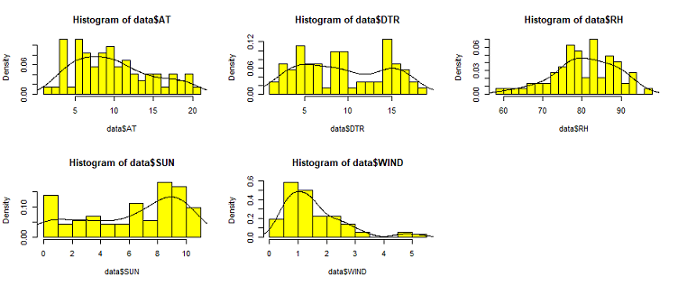
</div>

## 空气污染因子描述统计
```r
hist(GAM$PM2.5, breaks = 15, col = "red", freq = FALSE)
lines(density(GAM$PM2.5))
```
<div align=center>
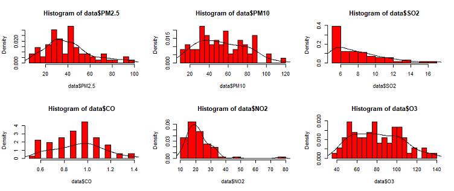
</div>

# 4 相关分析

## 相关分析  
### 背景
<font size=5.5>
&emsp;&emsp;相关分析是一种简单易行的测量定量数据之间的关系情况的分析方法，可以分析包括变量间的关系情况以及关系强弱程度等。比如，身高和体重的相关性；降水量与河流水位的相关性；工作压力与心理健康的相关性等。相关分析主要研究借助于若干分析指标（如相关系数、相关指数等）对变量间的依存关系的紧密程度作测定。它的适用范围很广，理论上讲，凡是考察两个变量相关性，都可以叫做相关分析。
</font>  

## 相关分析
### &emsp;分析步骤  

- <font size=5.5>`选择数据`</font>
- <font size=5.5>`绘制散点图`</font>
- <font size=5.5>`计算相关系数` </font>   

相关系数常见的有三类：Pearson相关系数、Spearman相关系数和Kendall相关系数。  

- <font size=5.5>`显著性检验`</font>  
 

## 相关分析 

</br/>
&emsp;&emsp;<font size=5.5>本文对于相关性的分析主要从下面两个角度展开：</font>  
</br/>  

- <font size=5.5>气象数据、空气污染数据与当日新增确诊数相关性</font>  

- <font size=5.5>气象数据、空气污染数据与当日新增死亡数相关性</font>
  

## 相关分析
### 一、气象数据、空气污染数据与当日新增确诊数相关性 

- <font size=5.5>绘制散点图</font>  
</br/>  
```r
install.packages("ggplot2")
library(ggplot2)
ggplot(data_GAM1,mapping =aes(x=PM2.5,y=DEATH))+geom_point()
```  

##
<div align=center>
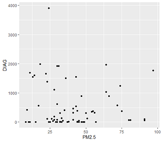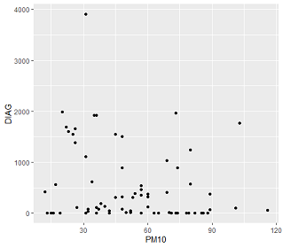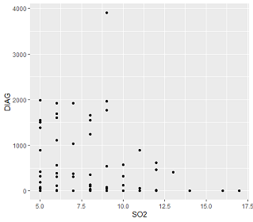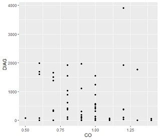

##
<div align=center>
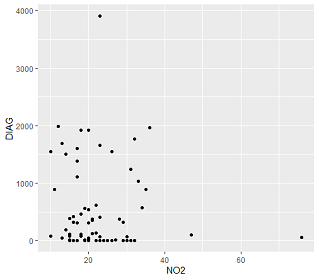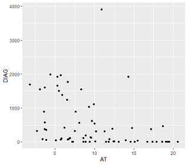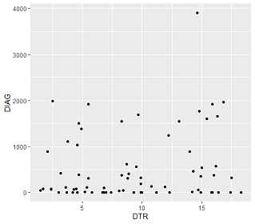  

## 
<div align=center>
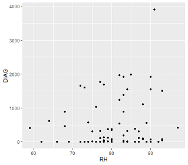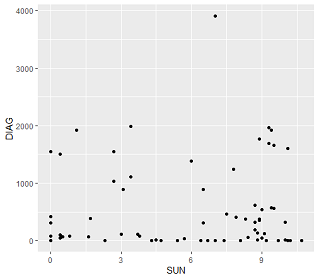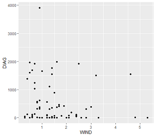  


## 相关分析  
###  一、气象数据、空气污染数据与当日新增确诊数相关性  

- <font size=5.5>计算相关系数</font>  
</br/>
```r  
s.xg1 <-cor(data_GAM1,method = "spearman")  
library(corrplot)
corrplot(s.xg1,type="lower",method="number",addCoef.col="red",pin=c(10,10))  
``` 
##  
<div align=center>
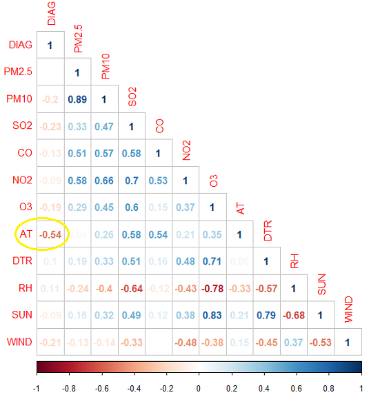

## 相关分析
### 一、气象数据、空气污染数据与当日新增确诊数相关性  

- <font size=5.5>显著性检验</font>  
```r  
install.packages("psych")
library(psych)
corr.test(data_GAM1,use="complete",method = "spearman")  
``` 
<div align=center>
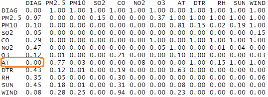

## 相关分析
### 二、气象数据、空气污染数据与当日新增死亡数相关性  
- <font size=5.5>绘制散点图</font> 
<div align=center>
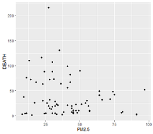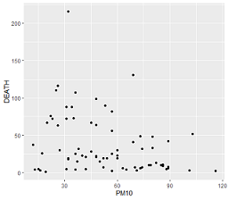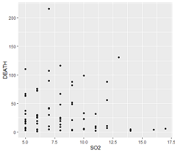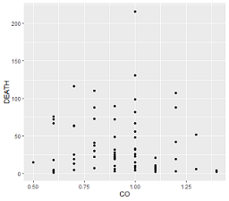   

##  
<div align=center>
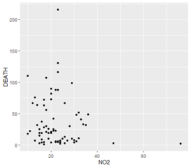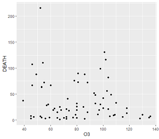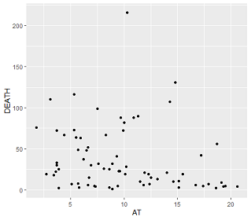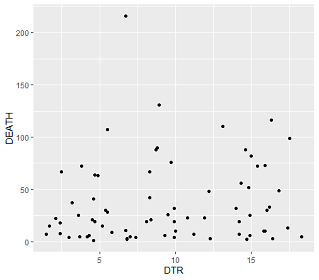  

## 
<div align=center>
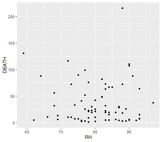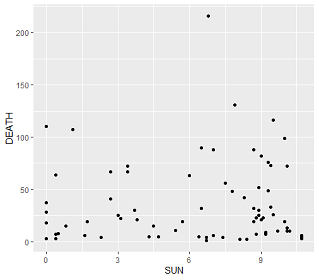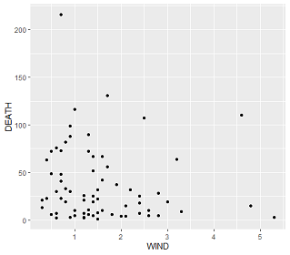  


## 相关分析
### 二、气象数据、空气污染数据与当日新增死亡数相关性  
- <font size=5.5>计算相关系数</font>   
<div align=center>
  

## 相关分析
### 二、气象数据、空气污染数据与当日新增死亡数相关性  
- <font size=5.5>显著性检验</font>  
</br/>
</br/>
<div align=center>
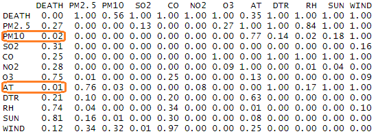

# 5 GAM模型

## GAM理论介绍

<font size=5.5>
</br>
</br>
</br>
&emsp;&emsp;GAM是由于数据驱动而非统计分布模型驱动的非参数回归。不需要设定参数模型，可以根据具体情况调整被解释变量条件期望的函数形式，也可以通过非参数的形式描述响应变量条件期望与被解释变量的函数关系，适用于响应变量与解释变量非线性和非单调关系的数据分析。
</font>

<font size=5.5>
</br>
&emsp;&emsp;GAM模型是GLM（广义线性模型）的基础上引入光滑函数，是GLM的半参数扩展，既可以对自变量进行线性拟合，也可以通过光滑函数进行拟合，因此可以成为半参数模型。
</br>
</br>
</br>
</font>

## GAM模型的建立
</br>
</br>
$$g(u_i)=\beta_0+f_1(x_{1i})+f_2(x_{2i})+...+\epsilon$$
<font size=5.5>
</br>
&emsp;&emsp;其中u<sub>i</sub>=E(y<sub>i</sub>)，g(.)是平滑连接函数，f用来控制各种非线性关系的各种样条函数，如自然样方函数（ns），B样条函数，局部平滑样条函数（Loess）和光滑样条函数（s）等。
</br>
</br>
&emsp;&emsp;样条函数的平滑参数控制模型拟合的效果，如果&lambda;太大，模型过拟合；如果&lambda;太小，模型欠拟合，这两中情况都会影响模型的拟合效果。
</br>
</br>
</br>
</font>

## GAM模型的建立
<font size=5.5>
</br>
平滑参数自由度&lambda;的选择原则；
</br>
</br>
（a）对于时间趋势的（即长期趋势）变量，通过30天最小化残差偏自相关函数（PACF）的和最小来确定。
</br>
</br>
（b）其他协变量如大气温度与湿度通过最小化AIC信息准则或最小化BIC信息准则来确定来确定。
</br>
</br>
（c）广义交叉验证（GCV），是均方误差最小的一种形式。
</br>
</br>
（d）固定自由度：根据生物学知识或之前在NMMAPS项目研究学习的经验来选择自由度(例如：大气温度为3或6，湿度为3)
</font>


## GAM参数估计
<font size=5.5>
</br>
</br>
</br>
</br>
</br>
&emsp;&emsp;对于广义相加模型的参数估计，与一般线性模型的参数估计类似，借助最小二乘法追求期望和观察值间的距离达到最小，但是相加模型还要使燕条函数拟合的预测变量在节点的连接处是光滑的，即采用惩罚迭代重加权最小二乘来估计回归系数。
</font>


## GAMM模型
<font size=5.5>

&emsp;&emsp;GAMM模型又称广义相加混合模型，是广义相加模型的基础上从对象异质性的观点出发，引入随机效应项，其模型的形式为:
</font>
</br>
</br>
<font size=2>
$$log[E(Y_t)]=\alpha+(\beta+\nu)x_{t-l}+s(time,df)+s(re-hum,df)+s(tem,df)+DOW+Random-effect+\epsilon$$
</font>
</br>
</br>
<font size=5.5>
1. 其中Yt表示观察日t的死亡人数；
</br>
</br>
2. E(Yt)表示观察日t死亡人数的期望值；
</br>
</br>
3. Xt表示观察日t的污染物日平均浓度；
</br>
</br>
4. l表示空气污染物的滞后日；
</br>
</br>
</br>
</br>
</br>
</br>
</br>
</br>
</br>
</font>

## GAMM模型
<font size=5.5>
</br>
</br>
</br>
</br>
5.&beta;表示通过回归模型估计的指示标量系数，表示污染物浓度每变化1个单位，人群日死亡人数自然对数的相对改变量；
</br>
</br>
6. S(time,df)、S(tem,df)与S(re-hum,df)为非参数平滑函数，用以控制时间趋势的长期趋势、季节、气象因素和其他一些与时间长期变异有关的混杂因素；
</br>
</br>
7. DOW表示亚元变量，用以控制短期波动的影响；
</br>
</br>
8. v表示随机效应，用以解释不同地区人口、社会经济等因素异质性对人群健康的影响。
</font>

## GAM模型实证分析


### 建立GAM基础函数：
<font size=1.99>
$$log[E(Y_t)]=\beta_0+\beta_1\,X_t+s(TIME,df) + s(AT,df)+s（DTR,df)+s(RH,df)+s(SUN,df)+s(WIND,df)+DOW+\epsilon$$
</font>

- E(Y<sub>t</sub>)为第t日的新增死亡人数的估计值；
- log为连接函数，对E(Y<sub>t</sub>)进行对数变换；
- X<sub>t</sub>为第t日的大气污染浓度，包括PM2.5、PM10、SO2、CO、NO2和O3；

- s(TIME，df)、s(AT，df)、s(DTR，df)、s(RH，df)、s(SUN，df)和s(WIND，df)为非参

&emsp;数平滑函数，分别表示时间、平均气温、日温度范围、平均相对湿度、日照时数和平

&emsp;均风速，用于控制长期趋势的影响；

- DOW为哑变量，表示“星期几效应”，用于控制短期波动的影响。

## GAM模型实证分析


### 武汉市COVID-19死亡人数GAM模型拟合效果：
<br/>

平滑效应项|估计自由度|参考自由度|Chi.sq|P
--|--|--|--|--|
AT  | 1.635 | 1.957 |  3.220 |   0.152    
DTR |8.782 | 8.960 | 66.506| 4.12e-11 ***
RH |  8.137|  8.677 | 32.901| 8.05e-05 ***
SUN | 1.740 | 2.128  | 2.393 |   0.369    
WIND| 7.196 | 8.109 | 10.614 |   0.204    

<br/>
注：`***`表示在0.001水平下是显著的，`**`表示在0.01水平下是显著的，`*`表示在0.05水平下是显著的，.表示在0.1水平下是显著的  

## GAM模型实证分析


### 去除WIND后的GAM模型拟合效果：
<br/>

平滑效应项|估计自由度|参考自由度|Chi.sq|P
--|--|--|--|--|
AT  | 1.648|  1.984|   4.357 |  0.0937 .  
DTR | 8.999 | 9.000 | 86.020 |9.50e-15 ***
RH | 5.823 | 6.812 | 38.950| 1.83e-06 ***
SUN  |2.221|  2.719  | 9.821 |  0.0310 * 

<br/>
注：`***`表示在0.001水平下是显著的，`**`表示在0.01水平下是显著的，`*`表示在0.05水平下是显著的，.表示在0.1水平下是显著的 

## GAM模型实证分析


### 气象因素对武汉市新冠肺炎死亡人数的影响效应：
<div align=center>
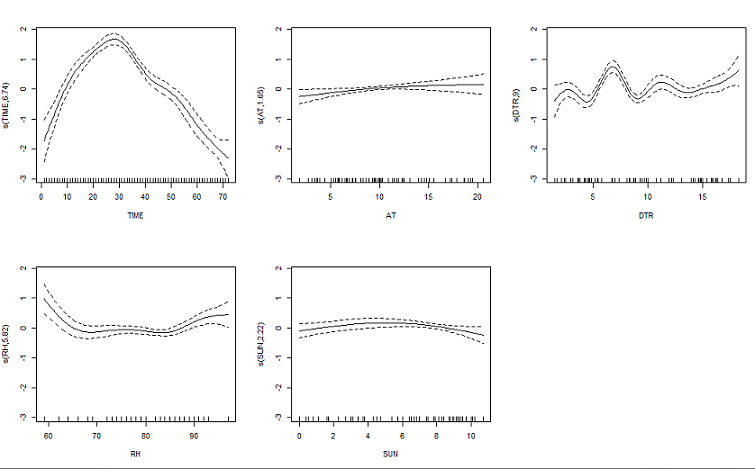
</div>


## GAM模型实证分析

### 气象因素对武汉市新冠肺炎死亡人数的影响效应：
<div align=center>
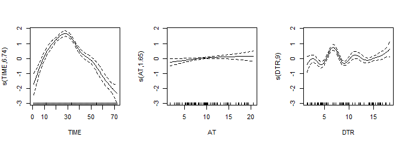
</div>

- 武汉市新冠肺炎死亡人数随时间推移，呈现先上升后下降的趋势，大约在25天左右出

&emsp;现峰值。

- 武汉市平均温度（AT）对武汉市新冠肺炎死亡人数的影响主要呈正向，随着平均温度

&emsp;（AT）的升高，死亡人数有所上升。

- 武汉市新冠肺炎死亡人数随武汉市日温度范围（DTR）的升高呈现波动上升趋势。

## GAM模型实证分析


### 气象因素对武汉市新冠肺炎死亡人数的影响效应：
<div align=center>
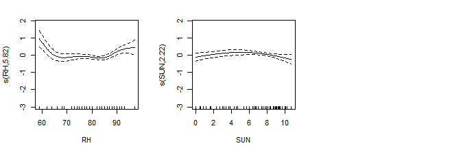
</div>

- 武汉市平均相对湿度（RH）对武汉市新冠肺炎死亡人数的影响呈现先下降，后平缓，

最后上升的趋势。RH<65%时，死亡人数随相对湿度的增加而较少，RH>85%时，死亡

人数随相对湿度的增加而增加，65%<RH<85%时，相对湿度的影响不明显。

- 武汉市日照时数（SUN）对武汉市新冠肺炎死亡人数的影响呈现先上升后下降的的趋

势。SUN<8h时，死亡人数随日照时数的增加而增加，SUN>8h时，死亡人数随日照时

数的增加而减少。

## GAM模型实证分析


### GAM模型的验证:（使用R软件中`mgcv`包的`gam.check`函数）:
<div align=center>
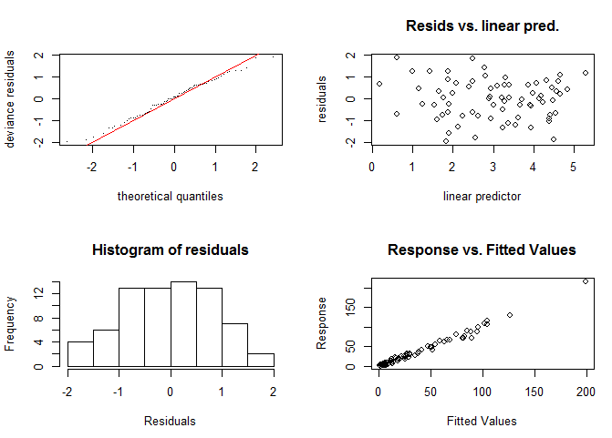
</div>
## GAM模型实证分析


### GAM模型的验证（使用R软件中`mgcv`包的`gam.check`函数）:
<br/>

- **残差QQ图：**横轴表示理论分位数，纵轴表示残差；图中的点大致在直线上，残差符合

&emsp;正态分布。

- **残差与预测散点图：**横轴表示线性预测值，纵轴表示残差；图中显示残差呈随机分布

&emsp;状态，没有明显的趋势。

- **残差直方图：**横轴表示残差，纵轴表示频次；直方图基本呈现“钟型”分布，且残差值在

&emsp;0 附近出现的频率最高。

- **观测值与拟合值散点图：**横轴表示拟合值，纵轴表示观测值；图中显示观测值和拟合

&emsp;值的匹配程度较好，基本呈 y=x 分布。
<br/>
<br/>

<font size=5>
&emsp;**以上四张图都说明模型整体拟合效果较好。**
</font>

## GAM模型实证分析


### 气象因素交互作用对武汉市新冠肺炎死亡人数的影响效应：
<br/>

平滑效应项|估计自由度|参考自由度|Chi.sq|P
--|--|--|--|--|
(AT,DTR)| 21.944 |25.770 | 157.2 | <2e-16 ***
(AT,RH) |21.435| 25.231|   99.3| 5.59e-11 ***
(AT,SUN) |25.271 | 27.82 | 152.1 | <2e-16 ***
(DTR,RH)| 26.366| 28.312 | 163.1 | <2e-16 ***
(DTR,SUN) |19.20 |23.093 | 150.8 | <2e-16 ***
(RH,SUN)| 23.23 |26.534 | 180.1 | <2e-16 ***

<br/>
注：`***`表示在0.001水平下是显著的，`**`表示在0.01水平下是显著的，`*`表示在0.05水平下是显著的，.表示在0.1水平下是显著的 

## GAM模型实证分析


### 气象因素交互作用对武汉市新冠肺炎死亡人数的影响效应：
<div align=center>
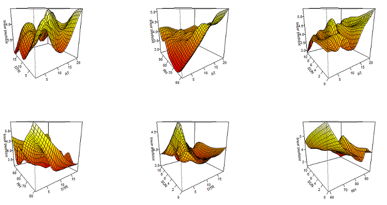
</div>

## 模型改进


### 分布滞后非线性模型<font size=5>（`Distributed Lag Non-Linear Models`）</font>：
<br/>
<br/>

<font size=5>
&emsp;&emsp;空气污染、气象等暴露因素对人体的的健康影响均有一定的持续性和

<font size=5>
滯后性。换言之，人群健康指标不仅与当天的暴露水平有关，还可能受昨

<font size=5>
天乃至十多天前暴露的影响。

<br/>

<font size=5>
&emsp;&emsp;分布滞后非线性模型（`DLNM`）同时考虑暴露因素的滞后效应和暴露—

<font size=5>
反应的非线性关系。
</font>