## 目录
<font size=6>
&emsp;&emsp;**1 引言** 
</font>
</br>
</br>
</br>
<font size=6>
&emsp;&emsp;**2 文献综述**    
</font>
</br>
</br>
<font size=6>
&emsp;&emsp;**3 描述性统计**   
</font>
</br>
</br>
<font size=6>
&emsp;&emsp;**4 相关分析**     
</font>
</br>
</br>
<font size=6>
&emsp;&emsp;**5 基本理论**     
</font>
</br>
</br>
<font size=6>
&emsp;&emsp;**6 实证分析**       
</font>
</br>
</br>
<font size=6>
&emsp;&emsp;**7 总结**     
</font>


# 1 引言

## 研究背景

<font size=5.5>
&emsp;&emsp;2019年12月，湖北省武汉市爆发新型冠状病毒肺炎（COVID-19）。2020年上半年，新型冠状病毒肺炎在世界范围内广泛传播，对公共卫生和世界经济产生了重大影响，引起了国内外的高度重视。
</font>

<font size=5.5>
&emsp;&emsp;从以往经历来看，传染病的发生、传播、流行与气象条件和空气污染密切相关。特定的气象条件对呼吸道疾病有一定的诱发作用，病毒的活跃程度和扩散能力与气温、气压、湿度、风速、降水、日照等气象因素密切相关。而空气污染则会削弱人体的呼吸道，降低人体免疫力，增加对病毒的易感性。
</font>

<font size=5.5>
&emsp;&emsp;目前，传染病学家已经发现COVID-19的主要传播途径是呼吸道飞沫和接触传播。湿度、风速等会影响到环境中液滴的稳定性；温度则可能会影响病毒在传播路径上的活性；污染微粒为病毒提供了寄身场所，帮助病毒扩散，进而影响新冠病毒的传播。
</font>

<font size=5.5>
&emsp;&emsp;因此，本研究基于武汉市的气象数据、空气污染数据与疫情数据，探索气象因素、大气污染物与COVID-19之间的关系。
</font>

## 研究方法
</br>
</br>
<font size=5.5>
**GAM广义相加模型：**可用于时间序列分析中，是广义线性模型的扩展，可

以处理多个变量的复杂非线性关系。
</font>

</br>
<font size=5.5>
**DLNM分布滞后非线性模型：**是在广义相加模型模型与分布滞后线性模型
</font>

<font size=5.5>
等传统模型思想基础上结合而成，处理非线性关系的同时还可以分析滞后
</font>

<font size=5.5>
效应。
</font>

# 2 文献综述


## 文献综述

<font size=5.5>
1、Bo Wang, Jiangtao Liu, Shihua Fu, et al. An effect assessment of Airborne particulate matter pollution on COVID-19: A multi-city Study in China [J]. medRxiv, 2020.
</br>
&emsp;&emsp;建立GAM模型，分析空气颗粒物污染PM2.5和PM10与72个城市的每日确诊病例之间的关系，结果认为PM2.5、PM10与COVID-19之间存在正相关关系。  
</font>
</br>
<font size=5.5>
2、Jianfeng Li, Linyuan Zhang, Zhihua Ren, et al. Meteorological factors correlate with transmission of 2019-nCoV: Proof of incidence of novel coronavirus pneumonia in Hubei Province, China [J]. medRxiv, 2020.
</br>
&emsp;&emsp;通过相关分析和线性回归，判断湖北省气象因素与COVID-19确诊病例之间的关系。
</font>
</br>
</br>
<font size=5.5>
3、Zonglin He, Yiqiao Chin, Jian Huang, et al. Meteorological factors and domestic new cases of coronavirus disease (COVID-19) in nine Asian cities: A time-series analysis [J]. medRxiv, 2020.
</br>
&emsp;&emsp;采用Pearson相关分析和GAM模型，研究每日新增COVID-19病例与平均气温和相对湿度之间的关系。作者认为，气象因素不太可能对COVID-19疫情产生重大影响。
</font>

## 文献综述

<font size=5.5>
4、劳家辉,刘志东,刘言玉,张静,姜宝法.昼夜温差对老年人群流感的影响及亚组分析.2018.
</br>
&emsp;&emsp;利用GAM模型探讨昼夜温差与发病数之间是否为线性关系，并利用DLNM模型定量评估昼夜温差对北京市老年人群流感发病的滞后效应。
</font>
</br>
</br>
<font size=5.5>
5、奉琪,苏莎,张劲夫,朱彩明.长沙市城区大气 PM2.5浓度与居民每日死亡关系研究[J].2018.
</br>
&emsp;&emsp;采用DLNM模型，控制时间长期趋势、气象因素、星期几及节假日效应等混杂因素，分析PM2.5单独暴露及其与PM10、NO2、SO2、CO等联合暴露当日至滞后14d时居民每日总死亡、心血管疾病死亡和呼吸系统疾病死亡的风险。</font>

# 3 描述性统计

## 数据来源

<font size=5.5>
**疫情数据：**来源于[湖北省卫生健康委员会](http://wjw.hubei.gov.cn/)，选取武汉市2020年1月20日至

2020年3月31日的每日确诊病例数和每日死亡病例数。   
</font>

</br>
<font size=5.5>
 **气象数据： **来源于[中国气象数据网](https://data.cma.cn/)，选取武汉市2020年1月20日至2020
</font>

<font size=5.5>
年3月31日的每日平均气温、平均相对湿度、日照时数、日温度范围和平
</font>

<font size=5.5>
均风速数据。
</font>

</br>
<font size=5.5>
**空气污染数据：**来源于[中国空气质量在线监测分析平台](https://www.aqistudy.cn/historydata/)，选取武汉市2020
</font>

<font size=5.5>
年1月20日至2020年3月31日的PM2.5、PM10、SO2、CO、NO2和O3数
</font>

<font size=5.5>
据。
</font>

## 变量描述
<div align=center>
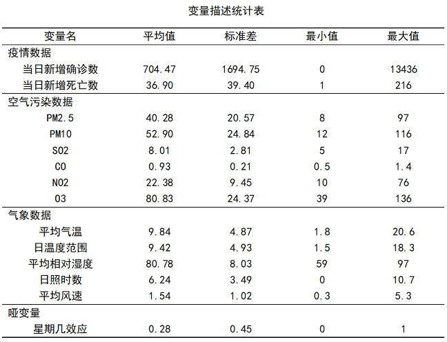
</div>
  
## 疫情数据描述
### 确诊人数与死亡人数
</br>
<div align=center>
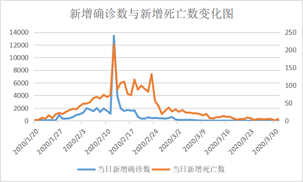
</div>
</br>
&emsp;&emsp;2月份是疫情的爆发期，在3月以后趋于平稳。新增死亡数和新增确诊数的曲线的走势基本一致。

---

### 武汉各区疫情情况
</br>
（1）武汉市各区域累计确诊人数变化折线图
<div align=center>
```{r,message=FALSE,echo=FALSE,warning=FALSE}
library(ggplot2)
library(reshape2)
library(forcats)
data<-read.csv('data/area_data1.csv')
data<-melt(data,id.vars = 'day',
           variable.name = "area",value.name = "num") 
data$day<-fct_inorder(data$day)
ggplot(data = data, mapping = aes(x = day, y = num, colour = area,group = area )) +
  geom_line(size = 0.5) +
  geom_point(size = 1) +
  labs(title = "武汉市各区域累计确诊人数变化折线图:",x = '时间',y = '人数/人') + 
  theme(axis.text.x = element_text(angle = 60, hjust = 0.5, vjust =0.5 ,size = 8))
```
</div>

---

### 武汉各区疫情情况
</br>
（2）3月31日武汉市各区累计确诊人数占比环形图
<div align=center>
```{r,message=FALSE,echo=FALSE,warning=FALSE}
library(ggplot2)
data<-read.csv('data/area_count1.csv')
data$proportion<-round(data$count/sum(data$count),3)
data$ymax<-cumsum(data$proportion) 
data$ymin<-c(0,head(data$ymax,n = -1))  
data$labelPosition<-(data$ymax + data$ymin)/2
data$label<-paste0(data$area,"\n",data$proportion)
ggplot(data)+
  geom_rect(aes(ymax = ymax,ymin = ymin,xmax = 0,xmin = 1,fill = id))+
  xlim(-1,1)+
  coord_polar(theta = "y")+
  theme_void()+
  geom_label(x = 0.7,y = data$labelPosition,label = data$label,size = 3)+
  labs(title = "3月31日武汉市各区域累计确诊人数占比环形图:",fill = '地区')+
  theme(legend.position = "right")
```
</div>

---

### 武汉各区疫情情况
</br/>
（3）3月31日武汉市各区累计确诊人数分布地图
<div align=center>
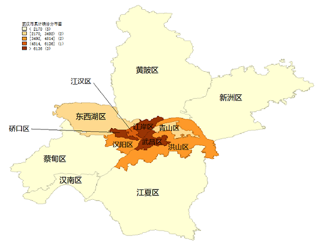
</div>
</br>
&emsp;&emsp;由上图可知，武汉市疫情由中心城区向远城区呈发散状分布。

## 疫情与气象、空气污染的时间变化规律
<div align=center>
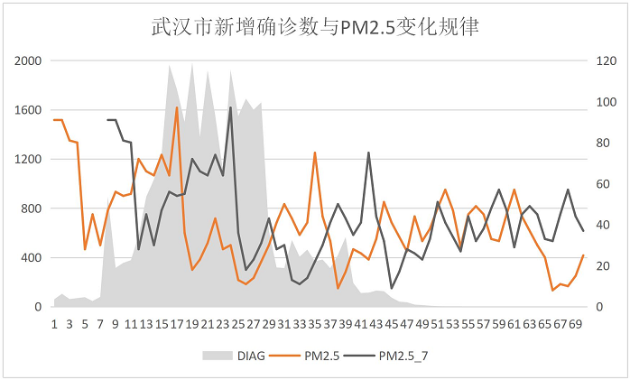
</div>
</br>
&emsp;&emsp;考虑滞后期的PM2.5序列与武汉市每日新增确诊数序列的时间变化规律比原PM2.5序列更为契合。

## 疫情与气象、空气污染的时间变化规律
<div align=center>
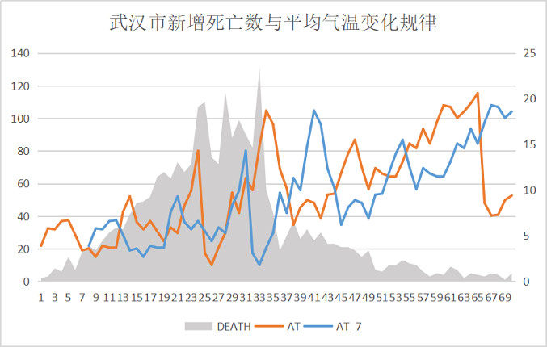
</div>
</br>
&emsp;&emsp;考虑滞后期的平均气温序列与武汉市每日死亡数序列的时间变化规律比原平均气温序列更为契合。

# 4 相关分析

## 相关分析

- <font size =6>空气污染数据与不同滞后期的新增**确诊**数相关性对比</font>
</br>
</br>
- <font size =6>气象数据与不同滞后期的新增**确诊**数相关性对比</font>
</br>
</br>
- <font size =6>空气污染数据与不同滞后期的新增**死亡**数相关性对比</font>
</br>
</br>
- <font size =6>气象数据与不同滞后期的新增**死亡**数相关性对比</font>

##
### 一.空气污染数据与不同滞后期的新增确诊数相关性对比
滞后期|0|1|2|3|4|5|6|7 
:-:|:-:|:-:|:-:|:-:|:-:|:-:|:-:|:-:
PM2.5|0.97|0.74|0.52|0.51|0.29|0.42|0.40|0.28   
PM10|0.10|0.14|0.14|0.12|0.20|0.08|0.10|0.15
SO2|0.05|0.01|0.01|0.00|0.01|0.00|0.00|0.00
CO|0.29|0.04|0.04|0.01|0.03|0.00|0.00|0.00
NO2|0.47|0.32|0.37|0.34|0.65|0.58|0.57|0.50
O3|0.12|0.06|0.02|0.02|0.03|0.01|0.01|0.00
<font size =4>（表中变量为空气中对应污染物浓度）</font>

## 
<div align=center>
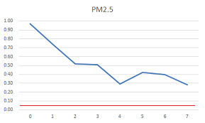 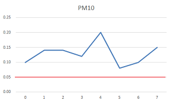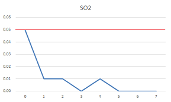
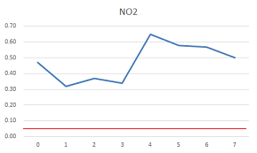 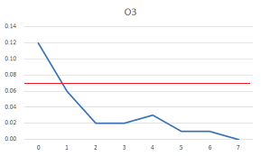  
<font size =4>（其中，横轴代表滞后期数，纵轴代表变量间相关性显著性水平）</font>


##
### 二.气象数据与不同滞后期的新增确诊数相关性对比
滞后期|0|1|2|3|4|5|6|7 
:-:|:-:|:-:|:-:|:-:|:-:|:-:|:-:|:-:
AT|0.00|0.00|0.00|0.00|0.00|0.00|0.00|0.00   
SUN|0.43|0.98|0.74|0.58|0.63|0.48|0.51|0.35
RH|0.35|0.24|0.21|0.10|0.09|0.09|0.04|0.02
DTR|0.45|0.14|0.06|0.04|0.05|0.02|0.01|0.01
WIND|0.08|0.18|0.33|0.53|0.48|0.47|0.61|0.69
<font size =4>（其中，AT代表平均气温，SUN代表日照时长，RH代表平均湿度，DTR代表日温度范围，WIND代表风速）</font>

##
<div align=center>
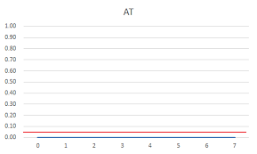 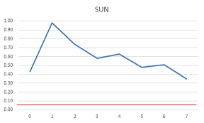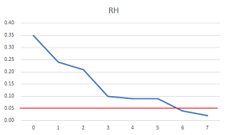 
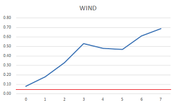  
<font size =4>（其中，横轴代表滞后期数，纵轴代表变量间相关性显著性水平）</font>

##
### 三.空气污染数据与不同滞后期的新增死亡数相关性对比
滞后期|0|1|2|3|4|5|6|7 
:-:|:-:|:-:|:-:|:-:|:-:|:-:|:-:|:-:
PM2.5|0.02|0.02|0.01|0.01|0.00|0.00|0.00|0.01   
PM10|0.27|0.54|0.51|0.42|0.42|0.21|0.35|0.59
SO2|0.31|0.11|0.04|0.01|0.00|0.00|0.00|0.00
CO|0.25|0.08|0.02|0.00|0.00|0.00|0.00|0.00
NO2|0.28|0.26|0.31|0.18|0.13|0.09|0.06|0.12
O3|0.75|0.35|0.16|0.14|0.02|0.01|0.00|0.00
<font size =4>（表中变量为空气中对应污染物浓度）</font>

# 5 基本理论


## GAM模型
### GAM模型概述
<br>
<br>

- Generalized Additive Model  广义相加模型


- GAM模型是在GLM（广义线性模型）的基础上引入光滑函数，是GLM的半参数扩展


- GAM模型是由数据驱动而非统计分布模型驱动的非参数回归


- 适用于因变量与自变量之间关系为非线性的数据分析


- 预先不知晓因变量与自变量之间关系的情况下，可以使用该模型

## GAM模型
### GAM模型中的基函数
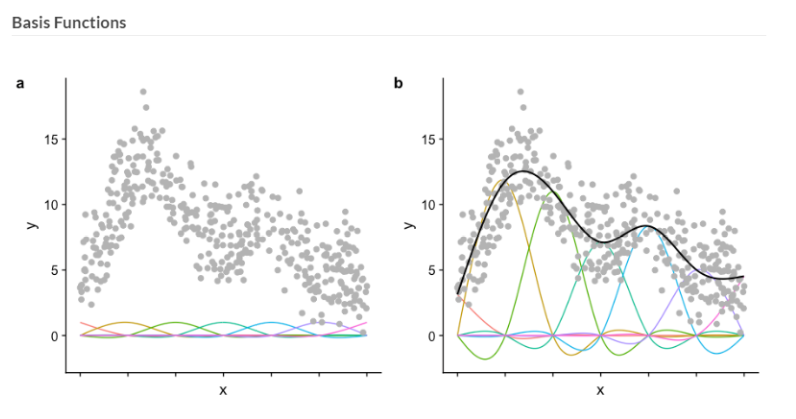
常用的基函数有正交函数、线性阈值函数或样条函数等

## GAM模型
### GAM模型的构建
$$log[E(Y_t)]=\alpha+\sum_{i=1}^n\beta_i\,X_i+\sum_{j=1}^mf_j(Z_j)$$

- Y<sub>t</sub>为观察日t日的确诊人数或死亡人数
- E(Y<sub>t</sub>)为观察日t日的确诊人数或死亡人数的期望值
- X<sub>i</sub>为对因变量产生线性影响的自变量
- β<sub>i</sub>为回归模型估计的解释变量系数
- f<sub>j</sub>(Z<sub>j</sub>)为样条函数
- Z<sub>j</sub>为对因变量产生非线性影响的变量

## GAM模型
### GAM模型中的样条函数

<br/>

|Term|Spline|样条|
|:---|:---|:---|
|tp|thin plate regression spline|薄板回归样条|
|cr|penalized cubic regression spline|三次回归样条|
|cs|shrinkage version of cr|收缩三次回归样条|
|cc|cyclic cubic regression spline|循环三次回归样条|
|ps|P-spline |P样条|
|cp|cyclic p-spline|循环P样条|

## DLNM模型
### DLNM模型概述
<br>
<br>

- Distributed Lag Non-Linear Model 分布滞后非线性模型

- DLNM模型同时考虑暴露因素的滞后效应和暴露—反应的非线性关系

- 计算滞后效应的意义是为了研究前几日的大气污染对之后的健康问题的影响

- 该模型不仅限于空气污染或气象因素对人类健康影响的研究，还可推广应用于任何研

&emsp;究预测变量与结局的关系及滞后效应的时间序列分析


## DLNM模型
### DLNM模型的构建
<br>
<br>

- 首先建立基于传统方法的基本模型，可为广义线性模型、广义相加模型或者广义

&emsp;估计方程等

- 然后对暴露-反应关系添加滞后维度，定义一个最长滞后天数

- 核心思想是构建交叉基(cross-basis)。对自变量与因变量的关系、滞后效应的分布

&emsp;分别选择合适的基函数，求两个基函数的张力积即得交叉基函数

- 最后计算相对危险度


## DLNM模型
### 相对危险度
<br>
<br>

根据`GAM`模型估计的暴露-反应回归系数`β`，计算相对危险度`（relative risk,RR）`：
$$RR=e^{β*IQR}$$
&emsp;式中：`IQR`为四分位距，`IQR` = 第三四分位数Q<sub>3</sub>  - 第一四分位数Q<sub>1</sub>

<br>

然后计算`RR`的`95%`置信区间`（95%CI）`：
$$95\%CI=[e^{(β-1.96Se)*IQR},e^{(β+1.96Se)*IQR}]$$
&emsp;式中：`Se`为标准误

# 6 实证分析

## 实证分析

### 气象因素对确诊人数的影响

<br/>

平滑项|估计自由度|参考自由度|F|P
--|--|--|--|--|
s(TIME)  | 6.576 | 7.281 |  81.574 | 0.000 ***
s(AT)  | 5.227 | 5.924 |  11.912 | 0.000 ***    
s(DTR) | 1.534 | 1.821 | 1.563 | 0.188
s(RH) | 1.000| 1.000 | 1.026 | 0.322     
    
<br/>
注：`***`表示在0.001水平下是显著的，`**`表示在0.01水平下是显著的，`*`表示在0.05水平下是显著的。

## 实证分析

### 气象因素对确诊人数的影响

```{r,message=FALSE,echo = FALSE,warning=FALSE}
data<-read.csv('data/GAM.csv')

library(nlme)
library(mgcv)
library(dlnm)
library(splines)

#确诊人数模型

#构建交叉基
cbPM2.5<-crossbasis(data$PM2.5,lag=c(0,7),argvar=list(fun="lin"),arglag=list(fun="integer"))
cbSO2<-crossbasis(data$SO2,lag=c(0,7),argvar=list(fun="lin"),arglag=list(fun="integer"))
cbO3<-crossbasis(data$O3,lag=c(0,7),argvar=list(fun="lin"),arglag=list(fun="integer"))

model1<-gam(DIAG~ s(TIME)+cbPM2.5+cbSO2+cbO3+s(AT)+s(DTR)+s(RH)+as.factor(DOW),family=quasipoisson,data=data)

par(mfrow=c(2,2)) 
plot(model1)

```

## 实证分析
 
### 气象因素交互作用对确诊人数的影响

<br/>

平滑项|估计自由度|参考自由度|F|P
--|--|--|--|--|
s(AT,DTR) | 18.10 | 20.763 |  1.996 | 0.0295 *    
s(DTR,RH) | 23.973 | 25.829 | 10.55 | 0.000 ***
s(AT,RH) | 8.214 | 10.932 | 0.678 | 0.747
    
<br/>
注：`***`表示在0.001水平下是显著的，`**`表示在0.01水平下是显著的，`*`表示在0.05水平下是显著的。

## 实证分析

### 气象因素交互作用对确诊人数的影响

```{r,message=FALSE,echo = FALSE}

#交互作用对确诊人数的影响，其中（AT,RH）不显著
model2<-gam(DIAG~ s(TIME)+PM2.5+SO2+O3+s(AT,DTR)+as.factor(DOW),family=quasipoisson,data=data)
model3<-gam(DIAG~ s(TIME)+PM2.5+SO2+O3+s(DTR,RH)+as.factor(DOW),family=quasipoisson,data=data)
model4<-gam(DIAG~ s(TIME)+PM2.5+SO2+O3+s(AT,RH)+as.factor(DOW),family=quasipoisson,data=data)

par(mfrow=c(1,2)) 
#绘制二维图，mgcv包里有vis.gam的具体教程
vis.gam(model2,view = c("AT", "DTR"),ticktype="detailed",color="heat",theta=-150)
vis.gam(model3,view = c("DTR", "RH"),ticktype="detailed",color="heat",theta=125)

```

## 实证分析

### 气象因素对确诊人数的滞后影响（RR及95%CI）

滞后期|AT|DTR|RH
--|--|--|--|
lag0 | 4.448（3.267~6.056） | 0.686（0.535~0.880） |  0.664（0.586~0.753）    
lag1 | 4.230（3.394~5.272） | 0.787（0.665~0.932） | 1.185（1.026~1.367） 
lag2 | 2.678（1.987~3.610） | 1.890（1.614~2.214） | 1.727（1.534~1.943） 
lag3 | 0.730（0.567~0.941） | 2.347（1.910~2.885） | 1.275（1.151~1.411）
lag4 | 1.391（1.111~1.742） | 0.438（0.354~0.541） | 0.773（0.674~0.887）
lag5 | 12.387（7.783~19.717） | 4.811（3.944~5.869） | 3.576（3.093~4.135） 
lag6 | 0.106（0.069~0.163） | 1.147（1.015~1.295） | 0.718（0.621~0.829）
lag7 | 18.101（11.763~27.855） | 0.643（0.565~0.731） | 1.476（1.350~1.613） 


## 实证分析

### 气象因素对确诊人数的滞后影响（RR及95%CI）
```{r,message=FALSE,echo = FALSE,warning=FALSE}
#气象对确诊人数的滞后
cbAT <- crossbasis(data$AT, lag=c(0,7), argvar=list(fun="lin"),arglag=list(fun="integer"))
cbDTR <- crossbasis(data$DTR, lag=c(0,7), argvar=list(fun="lin"),arglag=list(fun="integer"))
cbRH <- crossbasis(data$RH, lag=c(0,7), argvar=list(fun="lin"),arglag=list(fun="integer"))

model5<-gam(DIAG~ cbAT+cbDTR+cbRH+s(TIME)+s(PM2.5)+s(SO2)+s(O3)+as.factor(DOW),data=data,family=quasipoisson)

par(mfrow=c(1,3))
#AT
pred1.AT<-crosspred(cbAT,model5,at = 1)
plot(pred1.AT,var=1,type="p",ci="bars",col=2,pch=19,
     xlab="Lag Days of AT",ylab="RR(95%CI)") 

#DTR
pred1.DTR<-crosspred(cbDTR,model5,at = 1)
plot(pred1.DTR,var=1,type="p",ci="bars",col=2,pch=19,
     xlab="Lag Days of DTR",ylab="RR(95%CI)") 

#RH
pred1.RH<-crosspred(cbRH,model5,at = 1)
plot(pred1.RH,var=1,type="p",ci="bars",col=2,pch=19,
     xlab="Lag Days of RH",ylab="RR(95%CI)") 

```


## 实证分析

### 空气污染物对确诊人数的滞后影响（RR及95%CI）

滞后期|PM2.5|SO2|O3
--|--|--|--|
lag0 | 0.902（0.806~1.011） | 2.284（1.306~3.996）|  1.012（0.939~1.091）    
lag1 | 0.917（0.820~1.027） | 1.172（0.561~2.449） | 1.069（0.979~1.168） 
lag2 | 1.092（0.980~1.217） | 10.877（2.674~44.247）| 0.889（0.833~0.948）
lag3 | 1.246（1.118~1.390） | 3.139（1.258~7.831）| 0.784（0.707~0.869）
lag4 | 1.208（1.097~1.330） | 4.905（1.916~12.556） |0.808（0.731~0.895）
lag5 | 1.074（0.987~1.169） | 1.565（0.637~3.846） | 0.817（0.756~0.883）
lag6 | 0.979（0.911~1.051） | 1.783（1.029~3.091） | 0.896（0.823~0.964）
lag7 | 1.059（0.986~1.138） | 0.230（0.127~0.414）| 1.032（0.963~1.105） 


## 实证分析

### 空气污染物对确诊人数的滞后影响（RR及95%CI）

```{r,message=FALSE,echo = FALSE}

par(mfrow=c(1,3)) 
#PM2.5绘图
pred1.PM2.5<-crosspred(cbPM2.5,model1,at=10)
plot(pred1.PM2.5,var=10,type="p",ci="bars",col=2,pch=19,
     xlab="Lag Days of PM2.5 ",ylab="RR(95%CI)")
#SO2绘图
pred1.SO2<-crosspred(cbSO2,model1,at = 10)
plot(pred1.SO2,var=10,type="p",ci="bars",col=2,pch=19,
     xlab="Lag Days of SO2",ylab="RR(95%CI)") 
#O3绘图
pred1.O3<-crosspred(cbO3,model1,at = 10)
plot(pred1.O3,var=10,type="p",ci="bars",col=2,pch=19,
     xlab="Lag Days of O3",ylab="RR(95%CI)")

```

## 实证分析

### 气象因素对死亡人数的影响

<br/>

平滑项|估计自由度|参考自由度|F|p
--|--|--|--|--
s(TIME)|4.745|5.631|43.531|0.000***
s(AT)|8.646|8.918|3.790|0.006**
s(SUN)|1.312|1.504|3.331|0.039*
s(RH)|3.155|3.909|3.618|0.026*

<br/>
注：`***`表示在0.001水平下是显著的，`**`表示在0.01水平下是显著的，`*`表示在0.05水平下是显著的。

## 实证分析

### 气象因素对死亡人数的影响
```{r,message=FALSE,echo = FALSE}
data<-read.csv('data/GAM.csv')

library(nlme)
library(mgcv)
library(dlnm)
library(splines)

cbPM2.5<-crossbasis(data$PM2.5,lag=c(0,7),argvar=list(fun="lin"),arglag=list(fun="integer"))
cbSO2<-crossbasis(data$SO2,lag=c(0,7),argvar=list(fun="lin"),arglag=list(fun="integer"))
cbO3<-crossbasis(data$O3,lag=c(0,7),argvar=list(fun="lin"),arglag=list(fun="integer"))

model6<-gam(DEATH~ s(TIME)+cbPM2.5+cbSO2+cbO3+s(AT)+s(SUN)+s(RH)+as.factor(DOW),family=quasipoisson,data=data)

par(mfrow=c(2,2)) 
plot(model6)
```


## 实证分析

### 气象因素交互作用对死亡人数的影响

<br/>

平滑项|估计自由度|参考自由度|F|p
--|--|--|--|--
S(AT,SUN)|6.279|7.196|94.871|0.000***
S(AT,RH)|13.514|17,43|3.069|0.001***
S(RH,SUN)|7.765|10.437|2.355|0.020***

<br/>
注：`***`表示在0.001水平下是显著的，`**`表示在0.01水平下是显著的，`*`表示在0.05水平下是显著的。


## 实证分析

### 气象因素交互作用对死亡人数的影响

```{r,message=FALSE,echo = FALSE,fig.width=9,fig.height=4}


model7<-gam(DEATH~ s(TIME)+PM2.5+SO2+O3+s(AT,SUN)+as.factor(DOW),family=quasipoisson,data=data)
model8<-gam(DEATH~ s(TIME)+PM2.5+SO2+O3+s(AT,RH)+as.factor(DOW),family=quasipoisson,data=data)
model9<-gam(DEATH~ s(TIME)+PM2.5+SO2+O3+s(RH,SUN)+as.factor(DOW),family=quasipoisson,data=data)

par(mfrow=c(1,3)) 
vis.gam(model7,view = c("AT", "SUN"),ticktype="detailed",color="heat",theta=-35)
vis.gam(model8,view = c("AT", "RH"),ticktype="detailed",color="heat",theta=-35)
vis.gam(model9,view = c("RH", "SUN"),ticktype="detailed",color="heat",theta=-130)
```

## 实证分析

### 气象因素对死亡人数的滞后影响（RR及95%CI）
滞后期|AT|RH|SUN
--|--|--|--|
lag0|0.952(0.827~1.006)|0.990(0.958~1.022)|0.922(0.848~1.010)
lag1|1.194(1.056~1.363)|1.053(0.981~1.063)|0.970(0.897~1.050)
lag2|0.919(0.900~0.976)|1.023(0.990~1.059)|0.921(0.830~1.022)
lag3|0.958(0.617~0.953)|1.033(1.015~1.093)|1.747(1.661~2.042)
lag4|0.935(0.856~1.022)|0.992(0.963~1.023)|0.897(0.811~0.992)
lag5|0.987(0.928~1.076)|0.801(0.675~1.029)|1.064(0.879~1.073)
lag6|0.999(0.954~1.076)|1.024(0.986~1.065)|0.832(0.750~0.923)
lag7|0.950(0.886~1.020)|1.031(0.975~1.054)|1.028(0.852~1.043)


## 实证分析

### 气象因素对死亡人数的滞后影响（RR及95%CI）

```{r,message=FALSE,echo = FALSE}

cbAT <- crossbasis(data$AT, lag=c(0,7), argvar=list(fun="lin"),arglag=list(fun="integer"))
cbRH <- crossbasis(data$RH, lag=c(0,7), argvar=list(fun="lin"),arglag=list(fun="integer"))
cbSUN <- crossbasis(data$SUN, lag=c(0,7), argvar=list(fun="lin"),arglag=list(fun="integer"))

model<-gam(DEATH~cbAT+cbRH+cbSUN+s(PM2.5)+s(SO2)+s(O3)+s(TIME)+as.factor(DOW),data=data,family=quasipoisson)
par(mfrow=c(1,3))
#AT
pred1.AT<-crosspred(cbAT,model,at = 1)
plot(pred1.AT,var=1,type="p",ci="bars",col=2,pch=19,
     xlab="Lag Days of AT",ylab="RR(95%CI)") 
#RH
pred1.RH<-crosspred(cbRH,model,at = 1)
plot(pred1.RH,var=1,type="p",ci="bars",col=2,pch=19,
     xlab="Lag Days of RH",ylab="RR(95%CI)") 
#SUN
pred1.SUN<-crosspred(cbSUN,model,at = 1)
plot(pred1.SUN,var=1,type="p",ci="bars",col=2,pch=19,
     xlab="Lag Days of SUN",ylab="RR(95%CI)")
```

## 实证分析

### 空气污染物对死亡人数的滞后影响（RR及95%CI）

滞后期|PM2.5|SO2|O3
--|--|--|--|
lag0|1.063(0.973~1.161)|0.658(0.356~1.216)|1.055(0.962~1.571)
lag1|0.923(0.829~1.028)|0.923(0.829~1.028)|1.009(0.927~1.097)
lag2|1.046(0.963~1.136)|1.046(0.963~1.136)|0.963(0.913~1.16)
lag3|0.985(0.889~1.091)|1.042(0.534~2.034)|1.002(0.935~1.047)
lag4|0.911(0.845~0.982)|0.917(0.480~1.752)|0.965(0.906~1.028)
lag5|0.921(0.846~1.004)|1.084(0.521~2.258)|1.057(0.989~1.131)
lag6|1.009(0.936~1.088)|2.533(1.113~5.764)|1.002(0.939~1.068)
lag7|1.032(0.937~1.137)|0.983(0.548~1.766)|0.907(0.836~0.984)


## 实证分析

### 空气污染物对死亡人数的滞后影响（RR及95%CI）

```{r,message=FALSE,echo = FALSE}

model10<-gam(DEATH~ s(TIME)+cbPM2.5+cbSO2+cbO3+s(AT)+s(SUN)+s(RH)+as.factor(DOW),family=quasipoisson,data=data)
par(mfrow=c(1,3))
pred2.PM2.5<-crosspred(cbPM2.5,model10,at = 10)
plot(pred2.PM2.5,var=10,type="p",ci="bars",col=2,pch=19,
     xlab="Lag Days of PM2.5",ylab="RR(95%CI)") 
pred2.SO2<-crosspred(cbSO2,model10,at = 10)
plot(pred2.SO2,var=10,type="p",ci="bars",col=2,pch=19,
     xlab="Lag Days of SO2",ylab="RR(95%CI)") 
pred2.O3<-crosspred(cbO3,model10,at = 10)
plot(pred2.O3,var=10,type="p",ci="bars",col=2,pch=19,
     xlab="Lag Days of O3",ylab="RR(95%CI)") 
```
</br>


## 总结

<br/>

<font size=6.8>
1.大气污染物因素不同滞后期对确诊人数与死亡人数的

影响不同；
</font>

<br/>

<font size=6.8>
2.气象因素不同滞后期对确诊人数与死亡人数的影响也

不同。
<br/>
</font>