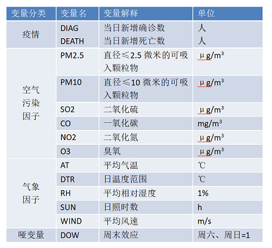
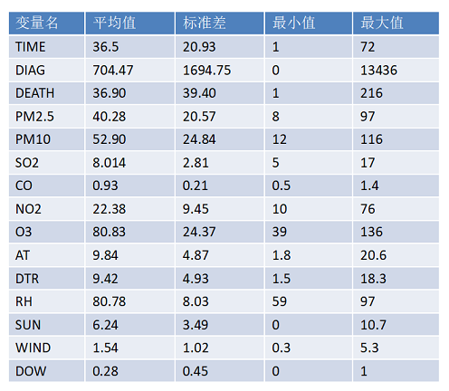
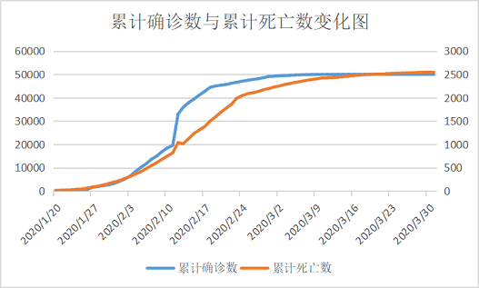
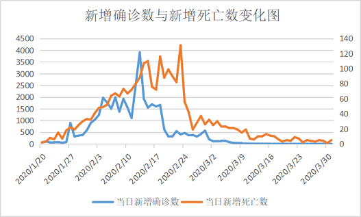
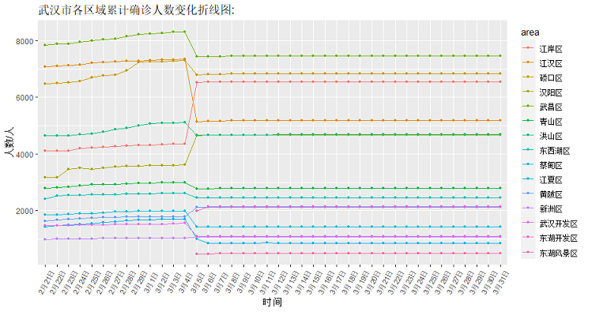
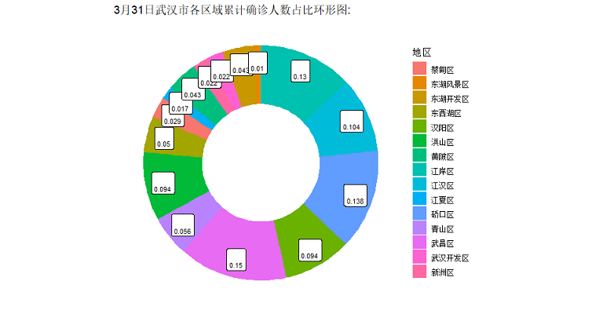
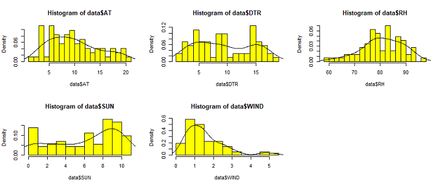
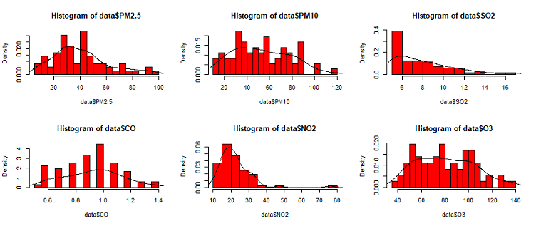

# 3 描述性统计

## 变量描述
### 变量解释
<div align=center>

</div>
---

### 变量描述统计
<div align=center>

</div>

## 疫情数据描述
### 确诊人数与死亡人数
</br>
<div align=center>

</div>
---

### 确诊人数与死亡人数
</br>
<div align=center>

</div>
</br>
</br>
</br>
&emsp;&emsp;武汉市累计确诊数与累计死亡数曲线、新增确诊数与新增死亡数曲线均基本一致。

---

### 武汉各区疫情情况
</br>
</br>
（1）武汉市各区域累计确诊人数变化折线图 - ggplot包
</br>
</br>
```r
ggplot(data = data, mapping = aes(x = day, y = num, colour = area,group = area )) +
  geom_line(size = 0.5) +
  geom_point(size = 1) +
  labs(title = "武汉市各区域累计确诊人数变化折线图:",x = '时间',y = '人数/人') + 
  theme(axis.text.x = element_text(angle = 60, hjust = 0.5, vjust =0.5 ,size = 8))
```
---

### 武汉各区疫情情况
</br>
<div align=center>

</div>
</br>
&emsp;&emsp;由于3月5日起大疫情网的统计口径由“按行政区统计”转变为“按现住址统计”，因此武汉各区累计确诊病例的增减变化较大，且新增两个区的统计数据。
</br>
&emsp;&emsp;各区累计确诊病例数在2月21日-3月5日前不断上升，在3月5日后趋于平缓。

---

### 武汉各区疫情情况
</br>
</br>
（2）3月31日武汉市各区累计确诊人数占比环形图 - ggplot包
</br>
</br>
```r
ggplot(data)+
  geom_rect(aes(ymax = ymax,ymin = ymin,xmax = 0,xmin = 1,fill = id))+
  xlim(-1,1)+
  coord_polar(theta = "y")+
  theme_void()+
  geom_label(x = 0.7,y = data$labelPosition,label = data$label,size = 3)+
  labs(title = "3月31日武汉市各区域累计确诊人数占比环形图:",fill = '地区')+
  theme(legend.position = "right")
```
---

### 武汉各区疫情情况
</br>
<div align=center>

</div>
</br>
&emsp;&emsp;在武汉地区中，武昌区、江岸区、硚口区的疫情较为严重，东湖风景区、江夏区、新洲区、武汉开发区的确诊人数相对较少。

---

### 武汉各区疫情情况
</br/>
（3）3月31日武汉市各区累计确诊人数分布地图 - GeoDa
<div align=center>

</div>
</br>
&emsp;&emsp;由上图可知，武汉市疫情由中心城区向远城区呈发散状分布。
</br>

## 气象因子描述统计
```r
library(ggplot2)
par(mfrow=c(2,3))
hist(data$AT, breaks = 15, col = "yellow", freq = FALSE)
lines(density(data$AT))
hist(data$DTR, breaks = 15, col = "yellow", freq = FALSE)
lines(density(data$DTR))
hist(data$RH, breaks = 15, col = "yellow", freq = FALSE)
lines(density(data$RH))
hist(data$SUN, breaks = 15, col = "yellow", freq = FALSE)
lines(density(data$SUN))
hist(data$WIND, breaks = 15, col = "yellow", freq = FALSE)
lines(density(data$WIND))
```

## 气象因子描述统计
<div align=center>

</div>

## 空气污染因子描述统计
```r
hist(data$PM2.5, breaks = 15, col = "red", freq = FALSE)
lines(density(data$PM2.5))
```
<div align=center>

</div>
